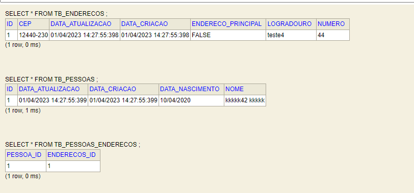

# api-rest-avaliacao-dev-backend-attornatus

### Avaliação API Rest Desenvolvedor Back-end Attornatus

## Desenvolvedor - Lucas Souza

#### Qualificações

* Java Core
* Maven
* Spring Boot
* JPA
* JDBC
* Oracle DB, MySQL, PostgresSQL
* Linux
* Git e CVS
* Javascript

#### Contatos
* Linkedin - https://www.linkedin.com/in/lucas-souza-478a031ab/
* GitHub - https://www.github.com/lucasdev3/

### Desafio Java

Usando Spring Boot, crie uma API simples para gerenciar Pessoas. Esta API deve permitir:

* Criar uma pessoa
* Editar uma pessoa
* Consultar uma pessoa
* Listar pessoas
* Criar endereço para pessoa
* Listar endereços para pessoa
* Poder informar qual endereço é o principal da pessoa

Uma Pessoa deve ter os seguintes campos

* Nome
* Data de Nascimento
* Endereço:
    * Logradouro
    * CEP
    * Numero

### QUESTÕES — QUALIDADE DE CÓDIGO
1.	Durante a implementação de uma nova funcionalidade de software solicitada, quais critérios você avalia e implementa para garantia de qualidade de software?
* Resposta: Como critérios avalio a funcionalidade ( a que se destina o produto ), confiabilidade, usabilidade, eficiência ( desempenho compatível com os requisitos do produto ), manutenção e portabilidade.

2.	Em qual etapa da implementação você considera a qualidade de software?
* Resposta: Considero a qualidade de software desde a identificação de defeitos até fase VV&T ( validação, verificação e testes ).


### DESENVOLVIMENTO

#### Tecnologias utilizadas

* Sistema Operacional: Windows (Compativel com linux, testado nas distribuições Ubuntu e Fedora).
* Java 11 Eclipse Adoptium jdk-11.0.17.8-hotspot.
* Maven 3.8.6.
* Banco de dados H2 (em memória) versão 1.4.193.
* Spring Boot 2.7.2
* JPA para persistencia e manipulação de dados.
* Bean validation para validações de atributos com validação global do tipo
  'MethodArgumentNotValidException'.
* Swagger para documentação e testes de requisições na API disponivel na
  url: http://localhost:8080/swagger-ui/
* Log4j para logs em runtime e criação de um arquivo de logs no diretorio:
  ```/tmp/logs/attornatus.log```
* JUnit para testes unitários

#### Pontos de atenção

* Verifique a versão do Java
* Verifique a versão do Maven
* Verifique a versão do Spring Boot
* Verifique a existencia do diretório de logs do Log4j. Caso a aplicação não crie automaticamente,
  crie-o manualmente (mais informações no arquivo log4j.properties no pacote de resources projeto).
* A API fica em execução na porta 8080 local. Garanta que a mesma esteja livre para subir a aplicação.
    * Compilar projeto e gerar artefato no target:
      ``` mvn clean package ```





* Artefato gerado no diretório ```api-rest-avaliacao-dev-backend-attornatus\target``` dentro do projeto.

* Execução via terminal
    * Abra o diretório do artefato e execute o seguinte comando:  ```java -jar api-rest-avaliacao-dev-backend-0.0.1-SNAPSHOT.jar```

#### Base de Dados H2
http://localhost:8080/h2-console/
#### Swagger-UI
http://localhost:8080/swagger-ui/


#### Regras criadas pelo desenvolvedor

* Não é possivel ter mais de uma pessoa com o mesmo nome no banco.
* Não é possivel cadastrar/atualizar uma pessoa no banco sem a lista de endereços
* Não é possivel cadastrar/atualizar uma pessoa sem ter ao menos um endereço com o atributo
  'enderecoPrincipal' com valor 'true (boolean)'.

#### Exemplo de cadastro de pessoa — PessoaDTO

* Metodo: POST - Rota: /pessoas/salvar
* JSON a ser enviado:
    ```
    {
        "nome": "teste44",
        "dataNascimento": "20-06-1996",
        "enderecos": [
            {
                "logradouro": "teste4",
                "cep": "12372-120",
                "numero": "44",
                "enderecoPrincipal": false
            },
            {
                "logradouro": "teste44",
                "cep": "12372-120",
                "numero": "55",
                "enderecoPrincipal": true
            }
        ]
    }
    ```
* JSON de resposta — Exemplo de sucesso (200 - Ok):
    ```
    {
      "date": "17/02/2023 01:50:43:271",
      "message": "Pessoa cadastrada com sucesso!"
    }
    ```
* JSON de resposta — Exemplo de falha (400 - BadRequest):
  ```
    {
      "date": "17/02/2023 01:52:07:430",
      "message": "Nome já cadastrado no banco!"
    }
  ```

#### Exemplo de listagem de pessoas

* Metodo: GET - Rota: /pessoas
    * Retorno:
      ```
      [
        {
            "nome": "teste44",
            "dataNascimento": "20-06-1996",
            "enderecos": [
                {
                    "logradouro": "teste4",
                    "cep": "12372-120",
                    "numero": "44",
                    "enderecoPrincipal": false
                },
                {
                    "logradouro": "teste44",
                    "cep": "12372-120",
                    "numero": "55",
                    "enderecoPrincipal": true
                }
            ]
        }
      ]
      ```
