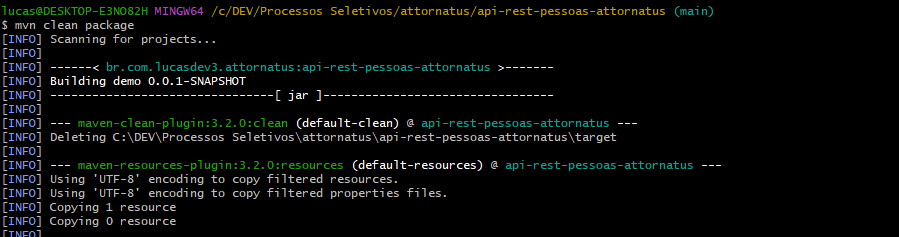
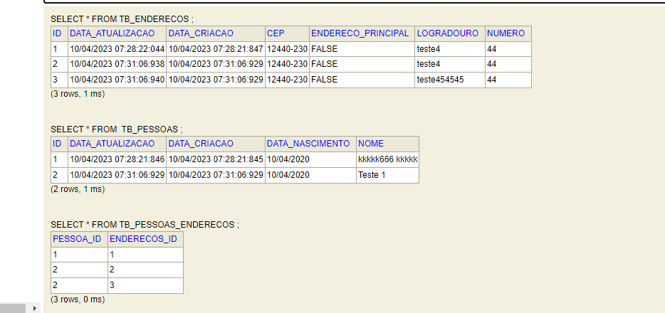

# api-rest-avaliacao-dev-backend-attornatus

### Avaliação API Rest Desenvolvedor Back-end Attornatus

## Desenvolvedor - Lucas Souza

#### Qualificações

* Java Core
* Maven
* Spring Boot
* JPA
* JDBC
* SOLID
* Design Patterns
* Oracle DB, MySQL, PostgresSQL
* Linux
* Shell Script
* Git e CVS
* Javascript

#### Contatos
* Linkedin - https://www.linkedin.com/in/lucas-souza-478a031ab/
* GitHub - https://www.github.com/lucasdev3/

### Desafio Java

Usando Spring Boot, crie uma API simples para gerenciar Pessoas. Esta API deve permitir:

* Criar uma pessoa
* Editar uma pessoa
* Consultar uma pessoa
* Listar pessoas
* Criar endereço para pessoa
* Listar endereços para pessoa
* Poder informar qual endereço é o principal da pessoa

Uma Pessoa deve ter os seguintes campos

* Nome
* Data de Nascimento
* Endereço:
    * Logradouro
    * CEP
    * Numero

### QUESTÕES — QUALIDADE DE CÓDIGO
1.	Durante a implementação de uma nova funcionalidade de software solicitada, quais critérios você avalia e implementa para garantia de qualidade de software?
* Resposta: Como critérios avalio a funcionalidade ( a que se destina o produto ), confiabilidade, usabilidade, eficiência ( desempenho compatível com os requisitos do produto ), manutenção e portabilidade.

2.	Em qual etapa da implementação você considera a qualidade de software?
* Resposta: Considero a qualidade de software desde a identificação de defeitos até fase VV&T ( validação, verificação e testes ).


### DESENVOLVIMENTO

#### Tecnologias utilizadas

* Sistema Operacional: Windows (Compativel com linux, testado nas distribuições Ubuntu e Fedora).
* Java 11 Eclipse Adoptium jdk-11.0.17.8-hotspot.
* Maven 3.8.6.
* Banco de dados H2 (em memória) versão 1.4.193.
* Spring Boot 2.7.10
* SOLID
* TDD
* JPA para persistencia e manipulação de dados.
* Bean validation para validações de atributos com validação global do tipo
  'MethodArgumentNotValidException'.
* Swagger para documentação e testes de requisições na API disponivel na
  url: http://localhost:8080/swagger-ui/
* JUnit e Mockito para testes unitários e de integração.


#### Pontos de atenção

* Verifique a versão do Java
* Verifique a versão do Maven
* Verifique a versão do Spring Boot
* A API fica em execução na porta 8080 local. Garanta que a mesma esteja livre para subir a aplicação.
    * Compilar projeto e gerar artefato no target:
      ``` mvn clean package ```





* Artefato gerado no diretório ```/target``` dentro do projeto.

* Execução via terminal
    * Abra o diretório do artefato e execute o seguinte comando:  ```java -jar api-rest-pessoas-attornatus-0.0.1-SNAPSHOT.jar```

#### Base de Dados H2
http://localhost:8080/h2-console/
#### Swagger-UI
http://localhost:8080/swagger-ui/


#### Regras criadas pelo desenvolvedor

* Não é possivel ter mais de uma pessoa com o mesmo nome no banco.
* Não é possivel cadastrar/atualizar uma pessoa no banco sem a lista de endereços

#### Exemplo de cadastro de pessoa — PessoaDTO

* Metodo: POST - Rota: /pessoas/salvar
  * JSON a ser enviado:
      ```
      {
        "nome": "Teste 1",
        "dataNascimento": "10/04/2020",
        "enderecos": [
            {
                "logradouro": "teste4",
                "cep": "12440-230",
                "numero": "44"
            },
            {
                "logradouro": "teste454545",
                "cep": "12440-230",
                "numero": "44"
            }
        ]
      }
      ```
    * JSON de resposta — Exemplo de sucesso (201 - CREATED):
        ```
        {
          "data": "Pessoa criada com sucesso!"
        }
        ```
    * JSON de resposta — Exemplo de falha (406 - Not Acceptable):
      ```
        { 
          "status": 406,
          "message": "Nome já está sendo utilizado!"
        }
      ```

#### Exemplo de listagem de pessoas

* Metodo: GET - Rota: /pessoas
* Retorno:
  ```
  {
    "data": [
        {
            "id": 1,
            "nome": "kkkkk666 kkkkk",
            "dataNascimento": "10/04/2020",
            "enderecos": [
                {
                    "id": 1,
                    "logradouro": "teste4",
                    "cep": "12440-230",
                    "numero": "44",
                    "enderecoPrincipal": false
                }
            ]
        },
        {
            "id": 2,
            "nome": "Teste 1",
            "dataNascimento": "10/04/2020",
            "enderecos": [
                {
                    "id": 2,
                    "logradouro": "teste4",
                    "cep": "12440-230",
                    "numero": "44",
                    "enderecoPrincipal": false
                },
                {
                    "id": 3,
                    "logradouro": "teste454545",
                    "cep": "12440-230",
                    "numero": "44",
                    "enderecoPrincipal": false
                }
            ]
        }
    ]
  }
  ```
  
#### Exemplo no banco de dados




